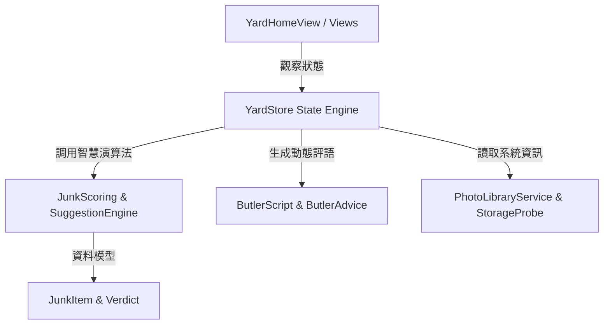

# 數位垃圾場 (Digital Garbage Can)

一款結合「毒舌管家」與互動體驗的 iOS 數位空間整理 App，將枯燥無味的清理過程轉化為有趣味性、有回饋感的遊戲化體驗！

---

## 📋 文章大綱 (Article Outline)
1. [ＡＰＰ特色](#1-app-特色-app-features)
2. [App 操作示範](#2-app-操作示範-app-demonstration)
3. [系統架構](#3-系統架構-system-architecture)
4. [核心程式](#4-核心程式-core-code-analysis)
5. [互動設計](#5-互動設計-interactive-design)
6. [開發過程中的困難](#6-開發過程中的困難-development-challenges)
7. [未來想新增功能](#7-未來想新增功能-future-roadmap)
8. [開發心得](#8-開發心得-development-reflections)
9. [GitHub 連結](#9-github-連結-github-link)

---

## 🌟 1. ＡＰＰ特色 (App Features)

* **🤖 毒舌管家「賈維鏽 (Butler)」**
  * 內建兩種語氣模式（`機智吐槽` / `溫和模式`），以幽默犀利的對話陪伴使用者面對整理拖延症，不會給人冰冷機械感。
* **📊 垃圾指數與健康度儀表板 (`JunkLoadGauge`)**
  * 即時計算相簿與檔案庫的「廢棄負載指數」與待整理件數，以擬真儀表板量化儲存健康度。
* **🃏 卡片滑動審查機制 (Salvage Run)**
  * 仿交友軟體滑動卡片互動（左滑刪除、右滑保留、上滑封存、下滑跳過），讓刪除照片變得像玩遊戲一樣流暢直覺。
* **🔍 智慧歸類建議引擎 (`SuggestionEngine`)**
  * 自動分析並歸類「雙胞胎重複照片」、「大檔案重量級項目」、「過期截圖與臨時檔案」，支援批次處理。
* **📦 30天膠囊封存機制 (Archive Seal)**
  * 對於猶豫不決、捨不得刪除的檔案，提供 30 天封存冷卻期，時間到自動二次提醒，大幅降低刪除決策的心理負擔。
* **🛡️ 誤刪復原防護 (`UndoToast`)**
  * 滑動決策後提供即時撤銷機制，手滑誤刪也能一鍵復原，清理過程無後顧之憂。

---

## 📱 2. App 操作示範 (App Demonstration)

1. **首頁儀表板 (YardHomeView)**：進入 App 即可看到當前相簿的垃圾指數、剩餘容量條，以及管家賈維鏽的打招呼評語。
2. **打撈特攻 (Salvage Run)**：點擊「進入垃圾場」，進入卡片審查模式，使用者可透過手勢左滑/右滑快速決定照片命運，畫面上方會即時出現管家的幽默吐槽。
3. **探索與分類專區 (ExploreView & SuggestionsView)**：檢視系統自動分類的「雙胞胎重複組」與「重量級大檔案」，支援快速單選或一鍵批次處置。
4. **項目詳情與依據審計 (ItemDetailView)**：點擊單一照片可檢視管家給出建議的具體依據（檔案大小、建立日期、重複標籤），並可自訂用途標籤（Tag）。
5. **結果結算與統計 (ResultsView)**：每次完成打撈審查後，顯示本次處理件數與成功清理的空間，帶來成就感。

---

## 🏗️ 3. 系統架構 (System Architecture)

採用 **SwiftUI + Swift Async/Await** 現代化架構，遵守單一信任源 (Single Source of Truth) 與關注點分離原則：



* **狀態管理層 (`YardStore`)**：使用 Swift 現代 `@Observable` 宏管理全域 App 狀態、項目清單、封存膠囊與復原佇列。
* **領域模型層 (Models)**：
  * `JunkItem`：檔案與相片的中繼資料實體。
  * `JunkScoring`：風險評級與智慧計分演算法。
  * `Butler`：管家對話腳本、評語語氣與分析依據生成器。
* ** UI 設計系統 (Design System)**：自訂語意化配色 (` yardCanvas`, `yardRecycle`, `yardTerracotta`) 與元件庫 (`ButlerAvatar`, `ButlerBubble`, `StorageBar`)。

---

## 💻 4. 核心程式 (Core Code Analysis)

### 判斷智慧演算法 (`JunkScoring.swift`)
根據檔案中繼資料計算權重得分與風險評級：

```swift
static func evaluate(_ item: JunkItem) -> JunkScore {
    var points = 0
    var factors: [JunkFactor] = []

    // 1. 雙胞胎重複檔案評分
    if item.twinGroup != nil {
        points += 35
        factors.append(JunkFactor(label: "屬於重複群組", isPenalty: true))
    }

    // 2. 截圖格式評分
    if item.kind == .screenshot {
        points += 20
        factors.append(JunkFactor(label: "螢幕截圖", isPenalty: true))
    }

    // 3. 系統自動預設檔名評分
    if item.hasMeaninglessName {
        points += 15
        factors.append(JunkFactor(label: "未命名或預設檔名", isPenalty: true))
    }

    // 4. 檔案保存時間（超過一年加分）
    if let days = item.ageInDays, days > 365 {
        points += 20
        factors.append(JunkFactor(label: "存放超過 1 年", isPenalty: true))
    }

    return JunkScore(points: points, factors: factors)
}
```

---

## 🎨 5. 互動設計 (Interactive Design)

* **卡片拖曳與物理傾斜**：在 `SalvageRunView` 中，手勢拖曳卡片時會依據 `drag.width` 計算動態旋轉角度 (`.degrees(Double(drag.width / 15))`) 與背景邊框顏色。
* **微光與動態動畫**：管家頭像 `ButlerAvatar` 結合心形眼睛機器人圖像，呈現圓形裁切與溫和邊框。
* **觸覺回饋 (Haptics)**：手勢超過觸發門檻 (`threshold = 110`) 時觸發系統震動，增強卡片劃過時的手感。

---

## 🛠️ 6. 開發過程中的困難 (Development Challenges)

1. **大量照片載入的效能瓶頸**：
   * **問題**：手機內若有上萬張照片，一次讀取會造成記憶體暴增與 UI 畫面凍結。
   * **解法**：採用非同步載入 (`async/await`) 與 LazyVGrid / 分頁快取，並透過 `PhotoLibraryService` 限制每次讀取的中繼資料數量。
2. **無障礙設計 (Accessibility) 與手勢平衡**：
   * **問題**：純手勢劃卡雖然直覺，但對某些使用者或無障礙需求不友善。
   * **解法**：在卡片下方設計四顆對應指令的實體按鈕（保留、封存、跳過、移除），讓按鈕操作與手勢發揮完全相同的邏輯。
3. **平台隱私限制與資訊透明度**：
   * **問題**：iOS 為保護使用者隱私，不會提供「檔案上次開啟時間」等數據。
   * **解法**：管家誠實公開系統限制（透過 `ButlerScript.limitationNote`），並明確列出評斷依據（檔名、大小、日期），建立使用者信任。

---

## 🚀 7. 未來想新增功能 (Future Roadmap)

* **🤖 On-Device AI 圖文分析 (Foundation Models)**：結合 Apple 最新本地端 AI 框架，自動辨識相似連拍照片、模糊焦距照片與發票收據內容。
* **📲 iOS 桌面小工具 (Widgets)**：開發 主畫面/鎖定畫面 小工具，即時顯示當前垃圾負載指數與管家的每日提醒。
* **🏆 整理成就與勳章系統**：新增連續清理天數 (Streak) 與清理容量解鎖勳章，進一步強化遊戲化誘因。

---

## 💭 8. 開發心得 (Development Reflections)

這次開發「數位垃圾場」是一次將**切身痛點**轉化為**趣味產品**的寶貴經歷。面對自己手機裡累積的上萬張照片，原本總是因整理繁瑣而選擇逃避；但透過引入「毒舌管家賈維鏽」這個靈魂角色與滑動卡片機制，原本枯燥的刪除過程變得像一場機智問答遊戲。這次經驗也讓我深刻體會到：**優秀的 UI/UX 不僅是視覺好看，更是透過巧妙的互動設計解決使用者的心理拖延**。

---

## 🔗 9. GitHub 連結 (GitHub Link)

* 專案 GitHub 儲存庫：[https://github.com/yushan0112/Digital-garabgecan.git](https://github.com/yushan0112/Digital-garabgecan.git)
